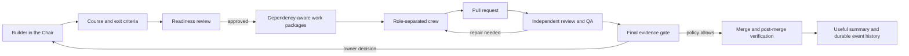
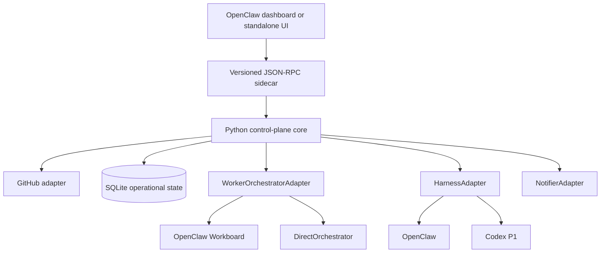

# Make It So

_Set the course. Engage the crew._

[](https://www.python.org/)
[](https://docs.openclaw.ai/plugins/sdk-overview)
[](https://developers.openai.com/codex/noninteractive)
[](LICENSE)


Make It So is an open-source, harness-neutral SDLC control plane that puts the builder in command of an agent crew. It separates deterministic state, policy, GitHub operations, workflow DAGs, worktrees, and evidence gates from the runtime that queues and executes workers.

OpenClaw Workboard is the P0 worker runtime. The built-in SQLite `DirectOrchestrator` provides a board-free path for Codex and portable integrations, while extension-owned adapter kinds support additional harnesses without moving GitHub policy or workflow logic into them. Repository requirements and implementation plans remain in each managed repository. Make It So stores leases, event history, model provenance, baselines, and run artifacts outside those repositories.

## Safety model

- Advisory mode inspects and recommends only.
- Supervised mode requires exact approval for each mutation.
- Autonomous mode may execute validated repository workflows.
- Only `AUTO_MERGE_ALLOWED` can authorize autonomous merge.
- Every code or documentation task starts in an isolated worktree from current `origin/main`.
- Coder, reviewer, tester, UX reviewer, final reviewer, merger, and verifier are role-separated workers.
- Technical blockers retry or route to Number 1 recovery while unrelated ready work continues.
- Only explicitly tagged secrets, access, goal divergence, and high-risk decisions require owner intervention.
- Provider, model, notification, and check failures produce blocked or degraded health instead of empty success.
- Unchanged planner inputs do not trigger repeated model calls; `--force-replan` is an explicit recovery override.

## Quick start

1. Install with `python -m pip install -e ".[dev]"`.
2. Copy `config/config.example.yaml` outside the repository and configure local paths and harnesses.
3. Add `.make-it-so/project.yaml` to a managed repository using `examples/project.yaml` as a starting point.
4. Run `make-it-so --config /path/to/config.yaml doctor`.
5. Run `make-it-so --config /path/to/config.yaml baseline --repo OWNER/REPO --harness openclaw --analyze --run-checks`.
6. Run three `shadow-canary` cycles before enabling a live cycle.

## Commands

- `make-it-so schema` writes the strict configuration JSON Schema.
- `make-it-so doctor` validates configuration, authentication, paths, and harness executables.
- `make-it-so model-check` validates the configured model, harness route, exact JSON schema, and fallback provenance.
- The OpenClaw dashboard validates edited model routes before saving and flags routes whose runtime capability is still unverified; use `model-check` before autonomous promotion.
- `make-it-so baseline` collects GitHub state, all canonical docs, source/dependency inventory, CI, tests, branches, worktrees, and configured checks.
- `make-it-so cycle` runs one bounded state-machine transition in shadow or live mode.
- `make-it-so cycle --continue-run --live` chains safe immediate transitions for up to six steps or 30 minutes.
- `make-it-so cycle --watch --live` advances only active PR and post-merge work without selecting new tasks.
- `make-it-so shadow-canary` runs repeated non-mutating cycles.
- `make-it-so status` reports state and recent events from SQLite.
- `make-it-so usage report` shows provider-reported tokens, fallback attempts, and telemetry quality.
- `make-it-so usage sync-openclaw` imports metadata-only OpenClaw worker session usage by repository.
- `make-it-so approve` records approval for one exact supervised action ID.
- `make-it-so schedule` installs an OpenClaw command cron or renders system cron, systemd, and Windows Task Scheduler definitions. Schedules are disabled and shadow-only by default.
- `make-it-so runtime-install` plans or installs isolated OpenClaw worker agents and their role protocols.
- `make-it-so orchestrate status|dispatch|reconcile` operates the configured runtime queue.
- `make-it-so orchestrate health` checks configured worker-agent model routes without invoking a model.
- `make-it-so orchestrate preflight` checks the adapter, model routes, Workboard, queue, and usage guard without dispatching workers.
- `make-it-so orchestrate canary` plans, explicitly dispatches, or checks a no-repository-mutation Workboard runtime canary.

With a Workboard orchestrator configured, the Number 1 cycle enqueues a policy-approved worker DAG instead of executing the implementation itself. Run reconciliation/dispatch frequently so ready cards are claimed promptly, and keep the slower Number 1 schedule for repository review and queue replenishment. Frontend-impacting PRs receive a dedicated UX worker covering flows, contrast, responsive behavior, accessibility, and visual cohesion before final Number 1 review.

Number 1 is the single high-level leadership role for a course: it gathers
requirements, maintains the milestone plan, reviews progress at each course
review cycle, and can reject or redirect work. Its session and context package
remain stable per repository/course even though coding, review, QA, and UX
workers use separate contexts.

See `docs/ARCHITECTURE.md` and `docs/TESTING.md` for runtime ownership and conformance requirements.
See `docs/PRODUCT_REORIENTATION.md` for the approved OpenClaw-first product direction and delivery plan.
See `docs/ADAPTERS.md` for the GitHub provider, harness, orchestration, tracking, notification, and scheduler boundaries used by Codex and future adapters.
See `docs/FUTURE_RUNTIME_ADAPTERS.md` for the implementation checklist and verification contract for those future runtimes.
See `docs/OPENCLAW_OPERATIONS.md` for the pause, resume, migration, canary, and autonomous-promotion runbook.
Runtime authors can run `make_it_so.conformance.run_runtime_conformance` against a
new queue adapter before adding runtime-specific integration tests.
Adapter packages can register queue, harness, and notifier builders through the
documented `make_it_so.runtime_adapters`, `make_it_so.harness_adapters`, and
`make_it_so.notifier_adapters` entry-point groups.

The CLI returns 0 for healthy/progress states, 2 for blocked or degraded states, and 3 for execution failures.

## The operating model

Make It So gives the builder a durable course, a bounded crew, and evidence
gates around every meaningful transition. The repository owns goals, plans,
acceptance criteria, and checks. Make It So owns leases, events, model
provenance, schedules, and operational history. The host runtime only supplies
workers and delivery surfaces through adapters.



The OpenClaw plugin provides the P0 dashboard tab, sidecar, Gateway methods,
and idempotent schedules. Workboard is the preferred OpenClaw worker adapter,
but it is optional. When no board is configured, the same workflow contract is
backed by the SQLite `DirectOrchestrator`.



## Why this is different from `/goal`

`/goal` is useful for an interactive, single-threaded coding session. Make It So
is for a repository or portfolio that must keep moving between sessions:

- a course preserves the approved goal, scope, prerequisites, checkpoints, and
  exit criteria;
- each work package gets a fresh context package instead of inheriting an
  unbounded conversation;
- implementation, review, QA, repair, final review, merge, and verification are
  separate auditable stages;
- unchanged evidence suppresses duplicate planning calls and repeated no-progress
  loops;
- every model attempt records requested and resolved model, role, stage, and
  provider-reported token counts;
- expensive models are reserved for planning, independent review, and final
  decisions, while routine coding and deterministic checks can use cheaper or
  local workers.

There is no synthetic billing calculation. Use `make-it-so usage report` to
inspect tokens by model, incomplete telemetry, fallback attempts,
failed calls, repeated prompt fingerprints, and high-consumption workflow stages.

## OpenClaw installation

Build the plugin and install it into the OpenClaw plugin directory from
`openclaw-plugin/`. Configure the Python sidecar path and a config file in the
OpenClaw host, then use the Make It So tab to register repositories and
courses. The default five-minute worker schedule and two-hour course-review
schedule are configurable in the dashboard or typed `schedules` configuration.
OpenClaw remains the live schedule source of truth: reconciliation repairs drift,
removes duplicate plugin-owned jobs, and preserves an operator-paused job.

```text
cd openclaw-plugin
npm ci
npm run check
npm test
npm run build
```

Use `/make-it-so status [OWNER/REPO]` for a concise chat summary. The native
command also supports `plan`, `approve`, `pause`, `resume`, `checkpoint`, and
`ack`; mutating subcommands require owner or `operator.write` scope. The
`openclaw make-it-so` CLI provides setup, diagnostics, migration validation,
bounded recovery, schedule management, and optional Workboard configuration.
The dashboard exposes the same schedule state and controls, including per-repo
scheduled-run enablement.

The first course remains in readiness review until the builder approves it.
Autonomy and merge policy are configured separately, so a course can continue
safe independent work while a dependency-scoped checkpoint waits for a human.
Planning is hybrid: use the dashboard's planning brief or ask the native host
conversation for `/make-it-so plan OWNER/REPO COURSE_KEY` in OpenClaw (or the
equivalent Codex MCP tool). The handoff is deterministic and token-free; only
the host model's questions and readiness answers consume model usage.

For a brand-new repository, **Create from the Chair** records the course first. Remote
repository creation is deliberately held until readiness is complete and the owner
engages the course, so a half-formed idea cannot silently become a public repository.

## Codex P1 host

`codex-plugin/make-it-so/` is the Codex boundary. Its MCP bridge exposes
doctor, baseline, status, bounded-cycle, token-report, course control, readiness,
checkpoint, attention, and claimed-worker lifecycle tools. `DirectOrchestrator`
keeps workflow state durable without requiring a kanban board. The plugin's
`serve_ui.py` hosts the same React build used by OpenClaw and proxies its API to
the Python sidecar with loopback defaults, same-origin checks, security headers,
and token-required remote binding. Codex-specific process details stay inside
this plugin; the core remains usable by another harness adapter.
