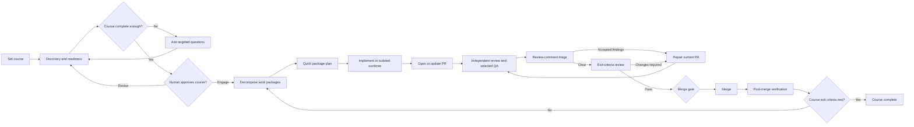

# Make It So Product Reorientation

## Summary

Make It So will become an OpenClaw-first SDLC control plane, with Codex as
the next supported runtime and all runtime-specific behavior isolated behind
typed adapters.

OpenClaw P0 will be a real TypeScript plugin. The SDK supports dashboard tabs,
HTTP routes, services, commands, tools, hooks, and Gateway methods. Make It So's
Number 1 leadership layer will use those surfaces while offering OpenClaw Workboard as its preferred
built-in orchestration adapter, not as a core requirement. Scheduling will remain
owned by the Gateway cron service and managed idempotently by the plugin UI.
[OpenClaw Plugin SDK](https://docs.openclaw.ai/plugins/sdk-overview),
[OpenClaw automation](https://docs.openclaw.ai/automation).

Codex P1 will use a Codex plugin containing skills and an MCP integration. The
same UI will initially run as a local web application because Codex does not
document an OpenClaw-style persistent dashboard tab. Codex will work without a
task board by default while permitting optional custom kanban integrations.
[Codex plugins](https://learn.chatgpt.com/docs/build-plugins.md),
[Codex apps](https://learn.chatgpt.com/docs/build-app.md).

## Number 1 Leadership

Number 1 is Make It So's first-in-command agent. Number 1 owns requirements
gathering, readiness, course planning, milestone governance, progress review,
and final course corrections. The role uses the highest-power configured
strategist route and has authority to reject an implementation, request repair,
or revise the approved course when the evidence no longer supports the plan.

Each repository/course receives one durable Number 1 leadership session. The
session identifier is stable for the life of that course, while every call still
records its own telemetry identifier. The runtime also persists a compact context
package containing the approved course, plan revision, recent reviews, pending
milestone proposals, and evidence. OpenClaw may continue the provider session;
other harnesses can use the same durable context contract without inheriting
OpenClaw session assumptions.

The configurable course-review cadence is the Number 1 review cycle. It is a
bounded review and planning checkpoint, not a separate project-manager role.
Worker agents remain role-separated and independent; Number 1 reviews their
evidence and controls the course rather than pretending to be the coder or
reviewer.

Completing a milestone creates a typed milestone checkpoint. In supervised mode,
the checkpoint pauses dependent work until the owner approves it. In autonomous
mode, routine graph-safe changes can be validated and applied by Number 1, while
major, destructive, or ambiguous changes remain owner-gated. Every add, update,
or removal is versioned against the course revision, recorded in SQLite, and
rejected when stale or graph-invalid. The dashboard exposes the current revision,
Number 1's latest review, pending proposals, and direct approve/reject actions.

## Architecture

- Retain the tested Python control-plane core. Do not rewrite it in TypeScript.
- Add a TypeScript OpenClaw plugin that manages a version-matched Python sidecar
  through local JSON-RPC over stdio.
- Build one React/TypeScript/Vite UI reused by the OpenClaw dashboard tab and the
  standalone Codex-facing server.
- Move runtime assumptions behind `HarnessAdapter`, `WorkerOrchestratorAdapter`,
  `WorkTrackerAdapter`, `SchedulerAdapter`, `NotifierAdapter`,
  `UsageTelemetryAdapter`, and `InteractionAdapter`.
- `WorkerOrchestratorAdapter` handles dispatch, claims, dependencies, retries,
  cancellation, and completion proof.
- `WorkTrackerAdapter` optionally mirrors packages into an external kanban or
  task system.
- Supply `DirectOrchestrator` and `NullWorkTracker` for operation without a board.
- Supply `OpenClawWorkboardAdapter` for built-in OpenClaw worker orchestration and
  tracking.
- Allow future adapters for GitHub Projects, Jira, Linear, or user-provided kanban
  systems. An adapter may implement orchestration, tracking, or both.
- Make It So will not build a separate user-facing kanban. SQLite stores
  workflow state and evidence, not a replacement board.
- Remove hard-coded Hermes configuration and roadmap references. Unsupported
  runtimes use the generic adapter registration contract.
- Keep GitHub, policy, workflow topology, context packaging, worktrees, evidence
  gates, and state transitions in the runtime-neutral core.
- Keep project truth in managed repositories:
  - `.make-it-so/project.yaml` for checks, surfaces, documentation, and durable
    policy.
  - `.make-it-so/courses/<course-id>.yaml` for approved goals, scope, exit
    criteria, work packages, and checkpoints.
  - Human-readable plans under the repository's configured documentation path.
- Keep live status, model provenance, leases, events, schedules, token usage,
  external-card mappings, and notification history in Make It So SQLite.
- Add versioned `Course`, `ReadinessRequirement`, `WorkPackage`, `Checkpoint`,
  `QAProfile`, `ModelProfile`, `ModelCapability`, `WorkMapping`, and
  `TokenUsageRecord` schemas.
- Expose a versioned core API for repositories, courses, checkpoints, schedules,
  overview state, token usage, model routing, work coordination, and execution.

## OpenClaw P0

The plugin will register:

- A `Make It So` Control UI tab backed by `/make-it-so/`.
- Authenticated plugin HTTP routes serving the UI and API proxy.
- A background service that starts and monitors the Python sidecar.
- Gateway methods under `makeItSo.*`, protected by appropriate operator scopes.
- Optional agent tools for reading course state, recording planning answers,
  resolving checkpoints, and engaging approved work.
- A namespaced `/make-it-so` command for status, planning-session links, pause,
  resume, approval, and attention acknowledgement.
- An `openclaw make-it-so` CLI group for setup, diagnostics, migration,
  schedules, recovery, and Workboard configuration.

The plugin will manage two global cron jobs rather than multiplying jobs per
repository:

- A five-minute deterministic reconciliation safety job. It invokes no model when
  nothing changed.
- A configurable course-review job, initially every two hours. It invokes planning
  only when repository evidence changed and execution capacity exists.

When the Workboard adapter is enabled, Workboard events will trigger immediate
reconciliation so workers do not routinely wait for the next cron run. Cron remains
the recovery mechanism and scheduler source of truth. Schedule creation, pause,
resume, and cadence will be available in the UI.

When enabled, Workboard is authoritative for OpenClaw worker cards, claims,
dependencies, retries, proof, and worker assignment. Make It So remains
authoritative for portable courses, work packages, policies, evidence, and state
transitions. Workboard card IDs are adapter mappings rather than core identifiers.

The OpenClaw plugin must remain functional when Workboard is disabled or unavailable
by using `DirectOrchestrator` and `NullWorkTracker`.

## Planning And SDLC

Planning will use a hybrid wizard and agent conversation:

- The UI starts "Set Course," selects greenfield, in-progress takeover, or
  shipped-product feature work, and collects structured prerequisites.
- A capable Number 1 model asks only questions that cannot be answered through
  repository and environment inspection.
- A readiness review checks goals, non-goals, users, architecture constraints,
  permissions, secret references, external access, environments, test data, CI,
  deployment, rollback, observability, security, UX inputs, token policy, and exit
  criteria.
- The model produces a Course Charter and dependency-aware work-package graph.
- The user approves the complete course once before repository mutation begins.
- For greenfield work, repository creation occurs only after course approval and
  explicit visibility and ownership confirmation.

The implemented planning handoff is deliberately host-native: the dashboard can
show a deterministic planning brief, OpenClaw exposes `/make-it-so plan` and
`make_it_so_start_planning`, and Codex exposes the equivalent MCP tool. These
surfaces return durable course context and unresolved questions without spending
model tokens; the active host conversation asks the questions and records answers
through the readiness API. Approval still gates all repository mutation, and a
course cannot be approved without at least one actionable work package or a
cycle-free dependency graph.

Review-comment triage will collect human, agent, bot, and CI findings and classify
each as `address`, `already_addressed`, `reject_with_reason`, `follow_up`, or
`needs_human`. Accepted findings create repair work; a new PR head invalidates stale
review evidence and reruns applicable gates.

QA will be capability-driven rather than assuming an application type:

- Web UI: browser flows, accessibility, contrast, responsive layouts, screenshots,
  functionality, visual hierarchy, and cohesion.
- CLI: help, errors, exit codes, stdin/stdout/stderr, interactivity, scripting,
  installation, and cross-platform behavior.
- API: contracts, authorization, errors, idempotency, and compatibility.
- Library: public API, packaging, examples, and backwards compatibility.
- Data pipeline: correctness, replay safety, schema drift, partial failures, and
  data-quality checks.
- Infrastructure/release: deployment dry-runs, observability, rollback, and
  post-deploy verification.

The manifest can override detected surfaces and add third-party QA profiles through
the adapter registry.

## Checkpoints And Autonomy

The default will be course-gated autonomy:

- The user approves the Course Charter.
- Routine planning, coding, PR creation, review, comment repair, testing, QA, and
  documentation proceed automatically.
- Merge, release, deployment, secrets, billing, destructive changes, and goal
  divergence follow the configured policy.
- Planning may add milestone demonstrations or architecture decisions as checkpoints.
- A checkpoint blocks only dependent work packages. Unrelated ready work continues
  through the configured orchestrator.
- When Workboard is enabled, unrelated ready Workboard cards continue.
- The UI provides presets plus per-action overrides for advisory, approval-required,
  and autonomous behavior.
- Only an explicit course hold pauses the entire repository.

## Models And Token Usage

Use capability profiles rather than embedding provider model names directly in
workflow logic. The UI will allow exact runtime-specific routes to be configured for
every profile.

Recommended balanced routes:

- `strategist`: GPT-5.6 Sol at high effort for Course Charter synthesis and major
  architecture decisions.
- `course_verifier`: GPT-5.6 Sol at high effort for final course-level exit
  verification.
- `baseline_analyst`: GPT-5.6 Terra at high effort for baseline synthesis and
  implementation-gap analysis.
- `subsystem_analyst`: GPT-5.6 Luna at medium effort for bounded repository subsystem
  analysis.
- `readiness_reviewer`: GPT-5.6 Terra at high effort for prerequisite and completeness
  review.
- `decomposer`: GPT-5.6 Terra at medium effort for work-package decomposition and
  prioritization.
- `package_planner`: GPT-5.6 Terra at medium effort, or Luna medium for narrow packages.
- `fast_coder`: GPT-5.3-Codex-Spark at medium effort for routine, bounded
  implementation.
- `complex_coder`: GPT-5.6 Sol at high effort for cross-cutting implementation and
  difficult repairs that exceed Spark's intended scope.
- `focused_coder`: GPT-5.3-Codex-Spark at medium effort for small, bounded changes.
- `local_coder`: repository-qualified local models for bounded, low-risk
  implementation and repair.
- `code_reviewer`: GPT-5.6 Terra at high effort with a fresh context.
- `comment_adjudicator`: GPT-5.6 Terra at high effort; disputed, security, or P0
  findings escalate to Sol.
- `security_reviewer`: GPT-5.6 Terra at high effort, escalating to Sol for critical
  auth, secret, migration, or data-boundary work.
- `qa_assistant`: GPT-5.6 Luna at medium effort paired with deterministic tools.
- `ui_qa_reviewer`: GPT-5.6 Terra at medium effort for subjective usability and
  cohesion review.
- `recovery_planner`: GPT-5.6 Terra at high effort, escalating to Sol after repeated
  unchanged failures.
- `summarizer`: GPT-5.6 Luna at low effort or deterministic rendering.

GPT-5.3-Codex-Spark is a fast, less-capable research-preview model. It must remain
limited to bounded coding routes unless repository-specific evaluations justify a
wider role. Availability is discovered by the runtime adapter rather than assumed.

Model configuration will support:

- Global, runtime, repository, course, work-package, and workflow-stage overrides.
- Runtime, provider, exact model, reasoning effort, and supported execution mode.
- Primary routes and ordered fallbacks.
- Maximum input, output, and total-token limits.
- Escalation conditions and retry limits.
- Local/cloud preference and autonomous-use eligibility.
- Qualification states of `untested`, `shadow`, `canary`, `certified`, and
  `autonomous`.
- Presets for `Economy`, `Balanced`, `Maximum Quality`, `Local First`, and `Custom`.
- A separate, user-selected intelligence level that adjusts reasoning effort without
  silently replacing the chosen model. `Economy`, `Balanced`, `Deep`, and `Maximum`
  provide a clear starting point; every role and workflow stage remains individually
  editable for cases such as Sol at medium versus Sol at high.
- An effective-route preview showing which configuration layer supplied each value.
- Adapter-driven capability discovery so unavailable models or unsupported effort
  levels cannot be saved.
- A route test covering authentication, structured output, tool access, model
  provenance, and token telemetry.

The first UI implementation provides a strict route-shape preflight before saving
and marks routes without runtime capability metadata as `unverified`. The existing
`model-check` command remains the explicit provider-backed route test before an
unverified route is promoted to autonomous work; future adapters can implement
capability discovery without changing the UI or core policy. Repository routes can
be overridden from the dashboard at course and work-package scope; global and
runtime profiles are editable through the same sidecar boundary. The dashboard
also shows the effective route and its source layer; package routes override
course routes, and course routes override repository routes.

Local and inexpensive models must pass repository-specific canaries before autonomous
use. Failed attempts, risky scope, or repeated CI failures escalate to a stronger
model. Final review cannot silently downgrade.

Track only actual provider-reported token usage:

- Requested and resolved model.
- Repository, course, work package, workflow stage, runtime, and attempt.
- Input, cached-input, cache-write, reasoning, output, and total tokens when exposed.
- Successful, failed, and fallback attempts.
- Duration and explicit `complete`, `partial`, or `unknown` telemetry status.
- Aggregation by model, repository, course, work package, stage, and date.
- Alerts for repeated prompts, unused large contexts, failed attempts, fallback churn,
  and unnecessary frontier-model use.

Missing usage remains unknown and is never converted to zero or estimated. Optional
safeguards may use authoritative token counts.

## UI And Documentation

The dashboard will provide:

- Portfolio and repository registration.
- A clickable SDLC course map with current stages, dependencies, blockers, and evidence.
- Course planning chat, readiness checklist, plan diff, and Engage control.
- Attention queue for decisions and checkpoints.
- Crew activity with worker, model, task, duration, tokens, and outcome.
- Repository autonomy, channel routing, schedules, QA profiles, model routes,
  intelligence levels, and token limits.
- A visible UI acceptance gate for web work, including its current verdict, evidence,
  reviewer model, and any required repair loop.
- PR review and comment-triage status.
- Token usage and efficiency views by model.
- Direct links into Workboard only when its adapter is enabled.
- Links to GitHub and any configured external tracker artifacts.

The visual style will use restrained command-console cues, an original futuristic
chair illustration, and subtle optimistic science-fiction influence without copying
Star Trek logos, uniforms, ships, or trade dress.

### UI Acceptance Review

Web UI changes receive a dedicated, independent UI acceptance reviewer. This is not
a general code-review pass and never shares the coder's context. The reviewer uses a
browser-capable worker at mobile, tablet, and desktop sizes to verify three things:

- **Form:** labels, validation, disabled and error states, keyboard and touch
  interaction, and submission behavior.
- **Function:** primary user journeys, navigation, loading, empty, and failure states.
- **Finish:** contrast, focus visibility, responsive text and overflow, hierarchy,
  spacing, touch targets, and cohesion with the established design language.

Detected or declared web UI work always selects this gate; it cannot be silently
downgraded to generic QA by a repository toggle. The reviewer records the tested
flows, current commit, screenshots where supported, and actionable findings. A
material defect routes the work through repair and a fresh UI acceptance review before
final review or merge. The dashboard surfaces this gate alongside tests and code
review so a completed course cannot hide missing user acceptance evidence.

The README will include generated hero artwork, project badges and icons, architecture
and SDLC diagrams, screenshots, setup instructions, model and token guidance, and an
honest comparison with `/goal`: `/goal` tracks one Codex task objective, while
Make It So provides durable multi-repository state, scheduling, role-separated
workers, optional orchestration adapters, PR and QA gates, recovery, and
evidence-change suppression.

## Test Plan

Testing will be implemented with each milestone and PR. It is not deferred to a final
stabilization phase.

### Unit And Property Tests

- Configuration validation, inheritance, migrations, and invalid-field rejection.
- Course, readiness, checkpoint, work-package, PR, repair, and completion transitions.
- Advisory, approval-required, autonomous, merge, release, and protected-action
  policies.
- Model routing, capability discovery, effort validation, fallback strength, and
  escalation.
- Token attribution, partial telemetry, failed attempts, fallback attempts, and
  aggregation.
- Leases, idempotency, duplicate suppression, no-progress detection, and restart
  recovery.
- External-card mappings without making board IDs canonical.
- Property-based testing for state transitions, policy combinations, and idempotency
  keys.
- Mutation testing for routing, policy, approval, and merge-gate modules.

### Adapter Contract Tests

- Reusable conformance suites for every harness, orchestrator, tracker, scheduler,
  notifier, telemetry, interaction, and GitHub adapter.
- `DirectOrchestrator`, `NullWorkTracker`, and `OpenClawWorkboardAdapter`.
- Fake third-party orchestrator and kanban adapters proving extensibility.
- Core conformance tests must not import OpenClaw or Codex implementation modules.
- Every future adapter must pass the same behavioral contract before registration.

### Integration Tests

- TypeScript plugin and Python sidecar startup, shutdown, crash recovery, version
  negotiation, and malformed JSON-RPC.
- OpenClaw plugin installation, reload, health reporting, schedule reconciliation,
  and removal.
- Workboard dispatch, claim, dependency, retry, cancellation, completion-proof, and
  reconciliation behavior.
- OpenClaw operation with Workboard enabled, disabled, and unavailable.
- Direct Codex execution with no board.
- SQLite migrations, concurrent leases, interrupted transitions, and crash-after-push
  recovery.
- Model authentication failure, malformed structured output, model mismatch, fallback
  provenance, and incomplete telemetry.
- GitHub PR creation, reviews, unresolved threads, checks, mergeability, merge, and
  post-merge verification through disposable fixtures.

### UI Tests

- React component tests for repository, course, autonomy, checkpoint, model-routing,
  channel, and token controls.
- Playwright tests across desktop and mobile viewports.
- Keyboard navigation, screen-reader semantics, contrast, focus states, overflow, and
  responsive layout.
- SDLC graph behavior for every state, blocker, checkpoint, repair loop, and
  completion state.
- Effective model-route previews and unsupported-capability validation.
- Visual regression screenshots for core dashboard views.
- OpenClaw-hosted and standalone UI modes.

### End-To-End Tests

- Greenfield repository creation and first course.
- In-progress repository takeover and implementation-gap course.
- Major feature course against a shipped product.
- Full plan, implementation, PR, independent review, QA, comment triage, repair, exit
  review, merge, and verification lifecycle.
- OpenClaw Workboard orchestration.
- OpenClaw direct orchestration without Workboard.
- Standalone Codex with no tracker.
- Fake custom kanban integration.
- Dependency-scoped human checkpoint while unrelated work continues.
- Autonomous merge refusal for stale reviews, failed CI, unresolved threads, or unmet
  exit criteria.

### Failure, Security, And Efficiency Tests

- Stale SHAs, merge conflicts, pending or failed checks, missing permissions, expired
  authentication, provider outages, and notification failures.
- Duplicate schedules, overlapping runs, worker crashes, stale claims, and interrupted
  pushes.
- Repository-document prompt injection and attempts to override course or
  protected-action policies.
- Secret redaction, protected paths, destructive commands, production actions, and
  force-push restrictions.
- Suppression of repeated model calls when repository and GitHub evidence have not
  changed.
- Context-package size limits and accurate token attribution across failed and
  successful attempts.

### Quality Gates

- Target at least 90% line and 85% branch coverage overall.
- Require stronger targeted coverage for policy, routing, state transitions, merge
  gates, and token accounting.
- Run Ruff, Pyright, pytest, frontend lint, frontend typecheck, component tests,
  package builds, and secret scanning in CI.
- Run supported Python versions, Windows and Linux core tests, and supported
  OpenClaw/Node combinations.
- Prevent coverage regression.
- A milestone cannot be completed when its required unit, integration, adapter, or UI
  tests are missing.

## Delivery And Acceptance

1. Pause current live PrintHub execution and snapshot its state, configuration,
   Workboard cards, and token history.
2. Persist this approved plan without conducting another planning pass.
3. Refactor core contracts into optional orchestrator and tracker adapters while
   migrating existing configuration and state without rewriting audit history;
   display historical role records as legacy `captain` records.
4. Build the OpenClaw plugin, managed sidecar, schedule reconciliation, optional
   Workboard integration, and package/install flow.
5. Implement Course, readiness, checkpoint, work-package, model-routing, and
   token-record schemas and flows.
6. Build the reusable UI and OpenClaw dashboard integration.
7. Add review-comment triage and capability-selected QA workers.
8. Implement token-only model usage and efficiency reporting.
9. Rebuild the README and visual assets.
10. Add and run unit, property, mutation, adapter, integration, UI, security, and
    end-to-end tests alongside each implementation milestone.
11. Run disposable greenfield, takeover, and feature-course end-to-end tests through
    Workboard, direct OpenClaw, and direct Codex paths.
12. Migrate PrintHub through shadow mode, one course approval, one supervised canary,
    and one bounded autonomous PR before restoring normal scheduling.
13. Implement Codex P1 using the frozen core API, a Codex plugin and skill, MCP tools,
    standalone UI hosting, `DirectOrchestrator` by default, optional tracker adapters,
    and the existing `codex exec` harness.

Acceptance requires green CI, adapter conformance, an idempotent OpenClaw install, a
working dashboard tab, no duplicate crons or worker cards, successful operation
without Workboard, dependency-scoped checkpoints, all three onboarding modes, UI and
CLI QA fixtures, accurate token telemetry labels, configurable model and reasoning
routes, and one fully autonomous PrintHub work package from planning through
post-merge verification.

## Assumptions

- Hybrid wizard plus chat is the default planning experience.
- Course-gated autonomy is the default checkpoint policy.
- Greenfield repository creation is included after explicit course approval.
- One course may be engaged per repository at a time; additional courses may remain
  in draft.
- Workboard is the preferred OpenClaw orchestration adapter but is not required by
  the core.
- Codex defaults to direct orchestration with no kanban requirement.
- OpenClaw is P0, Codex is P1, and other runtimes are extension-only.
- The Python core remains authoritative; the OpenClaw plugin is a thin, managed host
  adapter.
- Implementation proceeds from this approved plan through bounded milestones; no
  additional planning pass is required.
